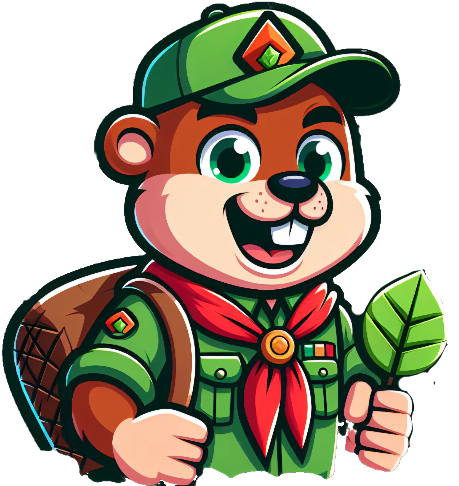

# Ecovi

!Ecovi Logo

**Ecovi** è un divertente gioco di puzzle ispirato a Candy Crush, ma con un tocco unico - il protagonista è un adorabile castoro! Unisciti a castorino in questa avventura emozionante nel brenta mentre risolvi puzzle coinvolgenti e raccogli la spazzatura per aiutare la comunità.

## Caratteristiche principali

- **Puzzle Coinvolgenti**: Combina e abbinare le risorse per superare i livelli e sbloccare nuove sfide.
- **Potenziamenti speciali**: Utilizza potenziamenti unici per superare ostacoli e raggiungere punteggi record.

## Come giocare

1. **Inizia a giocare**: Avvia il gioco da [qui](https://eco-crush.web.app/) e segui le istruzioni per iniziare il tuo viaggio con castorino.
2. **Completa i livelli**: Completa i puzzle abbinando le risorse e raggiungendo gli obiettivi richiesti esistono ben tre difficoltà.
3. **Condividi con gli amici**: Condividi i tuoi successi su social media e invita i tuoi amici a unirsi a te in questa avventura.

## Contatti

- Sito Web: [www.ecovi.com](https://eco-crush.web.app/)
- Email: 10934171@itisrossi.vi.it

## Crediti

Ecovi è stato sviluppato da Marco Colombara e Federico Femia.
